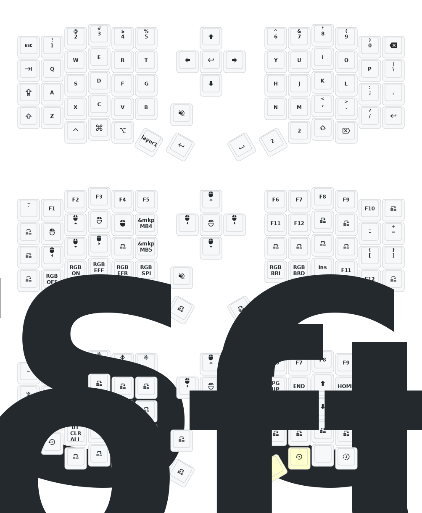

# zmk-sofle

Wireless Sofle ZMK configuration.

This is not the wired YoungMan DIY Sofle V2.0 QMK/Vial firmware repo. The wired
keyboard uses prebuilt `.bin` firmware files and a different flashing workflow.
Keep that material in the separate `sofle-wired` repository.

## Build

The normal build path is GitHub Actions:

1. Push changes to `main`, or run `Build ZMK firmware` manually from the Actions
   tab.
2. Download the workflow artifact after the build finishes.
3. Use:
   - `settings_reset.uf2` if Bluetooth pairing or saved settings need to be
     cleared.
   - `sofle_left_nice_view.uf2` for the left half.
   - `sofle_right_nice_view.uf2` for the right half.

## Flash

For each half:

1. Put the half into bootloader mode with the reset button.
2. Copy the matching `.uf2` file to the mounted bootloader drive.
3. Wait for the drive to eject itself.

On macOS the drive usually appears under `/Volumes/`.

```sh
cp sofle_left_nice_view.uf2 /Volumes/NICENANO/
cp sofle_right_nice_view.uf2 /Volumes/NICENANO/
```

On Bluefin Linux the drive usually appears under `/run/media/$USER/`.

```sh
cp sofle_left_nice_view.uf2 /run/media/$USER/NICENANO/
cp sofle_right_nice_view.uf2 /run/media/$USER/NICENANO/
```

If the two halves do not reconnect after flashing, flash `settings_reset.uf2`,
then flash the left and right firmware again and re-pair over Bluetooth.

## Local Build

Local builds can work on either macOS or Bluefin, but this repo is set up so
GitHub Actions is the less fragile path.

The local ZMK build shape is:

```sh
west init -l config
west update
west zephyr-export
python3 -m pip install -r zmk/app/requirements.txt
west build -s zmk/app -d build/left -b sofle_left -- -DZMK_CONFIG="$PWD/config" -DSHIELD="nice_view_adapter nice_view"
west build -s zmk/app -d build/right -b sofle_right -- -DZMK_CONFIG="$PWD/config" -DSHIELD="nice_view_adapter nice_view_custom"
```

Use Bluefin in a devcontainer, distrobox, or toolbox if host packages get messy.

## Keymap


